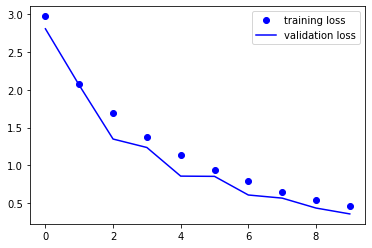

# Experiments with GRU - BiDirectional
### Predicting Temperature for Next Day using past 5 day sequence 

## What are Recurrent Networks?
Dense Networks has no Memory, they treat input as a whole and no state is kept in between inputs.
We are reading this by considering the previous word also, else all would sound cat. (Yes, That struck you just because it was out of context - It shows you were saving context from previous words too)

Older ones are called ```feedforward networks```, the ones we talking about are ```recurrent neural networks```


They (obviously RNN) maintain a STATE and has a LOOP. For a sentence with 10 words - the loop will run 10 times and consider the previous word for next output.

SimpleRNN are too simple sometimes, they just suffer from vanishing gradient and the state they save becomes negligible till the last word. We have LSTM (Long Short Term Memory) another varient of RNN that uses carry signal to aboud vanishing gradient but is HEAVY.

Techniques Presented with this Project
1. Recurrent Dropout
2. Stacking Recurrent Layers
3. Bidirectional Recurrent Layers

## What is Bi-Directional?
See
- Chronological Order is - 1990, 1991, 1992, ... 2019, 2020, 2021
- Non-Chronological Order is 2021, 2020, 2019 you got it.

At one time, we can follow a single order only (As per what we know). Sometimes the prediction make sense in chrono order and somtimes the other way. 

But what if word made sense from both sides? and we need both? - Both means Bi - and we are talking about sides - means directions = Getting? thats why we are using Bi-Directional RNN - that covers the data from both sides.

But how exciting it sounds, it is not that much. In weather or temperature forecasting - This years data would more depend on last year and not 1000 years before. 2 directions may not work in that case. 

It just works in sentence use cases more.



A random RNN graph from my training notebooks. It is more of an Art than Engineering.

Thanks